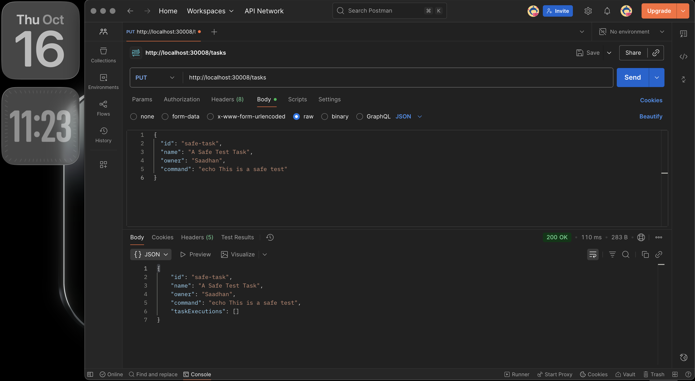

# Kaiburr Task 2: Kubernetes Deployment

**Candidate:** Saadhan
**Date:** October 16, 2025

---

## 📖 Description

This project takes the Java REST API from Task 1, containerizes it using **Docker**, and deploys it to a **Kubernetes** cluster. It also includes deploying a MongoDB database with persistent storage.

The application's "execute task" functionality has been modified to interact with the Kubernetes API, creating a new `busybox` pod to run shell commands instead of executing them locally.

### Key Features
- ✅ **Containerization:** A `Dockerfile` is provided to build the application into a lightweight container.
- ✅ **Kubernetes Manifests:** `deployment.yaml` and `service.yaml` files to deploy and expose the application.
- ✅ **Environment Configuration:** The application reads its MongoDB connection details from a Kubernetes environment variable.
- ✅ **Dynamic Pod Creation:** The API programmatically creates Kubernetes pods to execute tasks.
- ✅ **Persistent Storage:** MongoDB is deployed with a Persistent Volume to ensure data survives pod restarts.

---

## 🛠️ Technologies Used

- **Java 17** & **Spring Boot 3.x**
- **Docker** & **Docker Hub**
- **Kubernetes** (via Docker Desktop)
- **kubectl** CLI
- **Fabric8 Kubernetes Client** (for Java-to-Kubernetes API interaction)

---

## 🚀 Prerequisites

- A running **Kubernetes** cluster (e.g., from Docker Desktop).
- **Docker** installed and running.
- **kubectl** CLI installed and configured.
- A **Docker Hub** account to push the image.

---

## ▶️ Step-by-Step Deployment Guide

#### Step 1: Build and Push the Docker Image
First, you must build the application's Docker image and push it to a public registry like Docker Hub.

1.  **Log in to Docker Hub:**
    ```bash
    docker login
    ```
2.  **Build the image** (replace `your-username` with your Docker Hub username):
    ```bash
    docker build -t your-username/task1-k8s:latest .
    ```
3.  **Push the image:**
    ```bash
    docker push your-username/task1-k8s:latest
    ```
    *Note: Remember to update the `image` field in `deployment.yaml` to match this image name.*

#### Step 2: Deploy MongoDB to Kubernetes
Deploy a MongoDB instance to your cluster. A manifest file or the Docker Desktop UI can be used for this. The key requirements are:
- It must run in its own pod.
- It must have a service named **`mongodb-service`** so the application can connect to it.
- It must use a **Persistent Volume Claim** (`pvc`) to ensure data is not lost when the pod restarts.

#### Step 3: Deploy the Application
Apply the Kubernetes manifests to deploy the Java application.

```bash
kubectl apply -f deployment.yaml
kubectl apply -f service.yaml

---

```
#### 📸 Verification and Screenshots

1. Check Running Pods (kubectl get pods)
You should see one pod for the task-api-deployment and one for mongodb, both with a status of Running.


2. Check Services (kubectl get service)
You can see the services for both the API and MongoDB. Note the NodePort assigned to task-api-service.


3. Test an Endpoint

# task2-kaiburr
